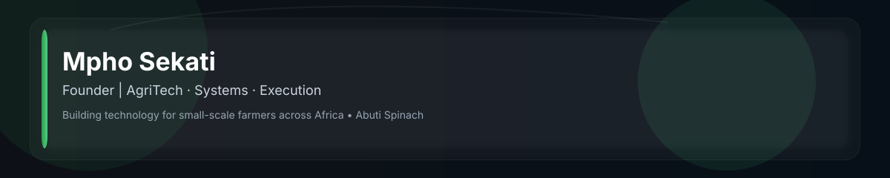

<!-- Glassmorphism profile README for Mpho Sekati -->

<!-- Header image (glass-style). Commit assets/glass-header.svg next to this README. -->
<p align="center">
  
</p>

---

## 👋 Hi — I'm Mpho Sekati
Builder focused on solving real-world problems in African agriculture through practical technology, systems thinking, and execution.

I work at the intersection of agriculture, software systems, and impact-driven entrepreneurship.

---

## 🌍 Current Focus
- Building technology for small-scale farmers in Africa
- Designing simple, scalable agricultural support systems
- Developing Abuti Spinach as a real-world AgriTech platform
- Exploring cloud systems and data-driven agriculture tools

---

## 🚀 Project: Abuti Spinach
**Abuti Spinach** is an AgriTech initiative supporting small-scale farmers with practical, accessible tools to improve productivity and decision-making.
- Early-stage real-world deployment
- Focused on smallholder farmers
- Subscription-based model (pilot phase)

---

## 📊 GitHub Activity
<p align="center">
  
  &nbsp;&nbsp;
  
</p>

<p align="center">
  
</p>

---

## 🧠 Skills & Focus Areas
System design, Cloud computing, Product development, AgriTech systems, Entrepreneurship, Execution.

```text
System Design          ████████████ 95%
Cloud Computing        ███████████░ 90%
Product Development    ███████████░ 90%
AgriTech Systems       ████████████ 95%
Entrepreneurship       ████████████ 95%
Execution              ████████████ 95%
```

---

## 📫 Connect
- Twitter / X: @mpho0sekati
- LinkedIn: (add your LinkedIn link)
- Website: (add your site)

---

Made with a glassy header for a modern, focused profile. If you'd like:
- I can commit README.md and assets/glass-header.svg directly to your repo (specify branch or default).
- Or I can add alternate color themes (light/dark), replace the header with an inline SVG data URI, or include more badges/social icons.
